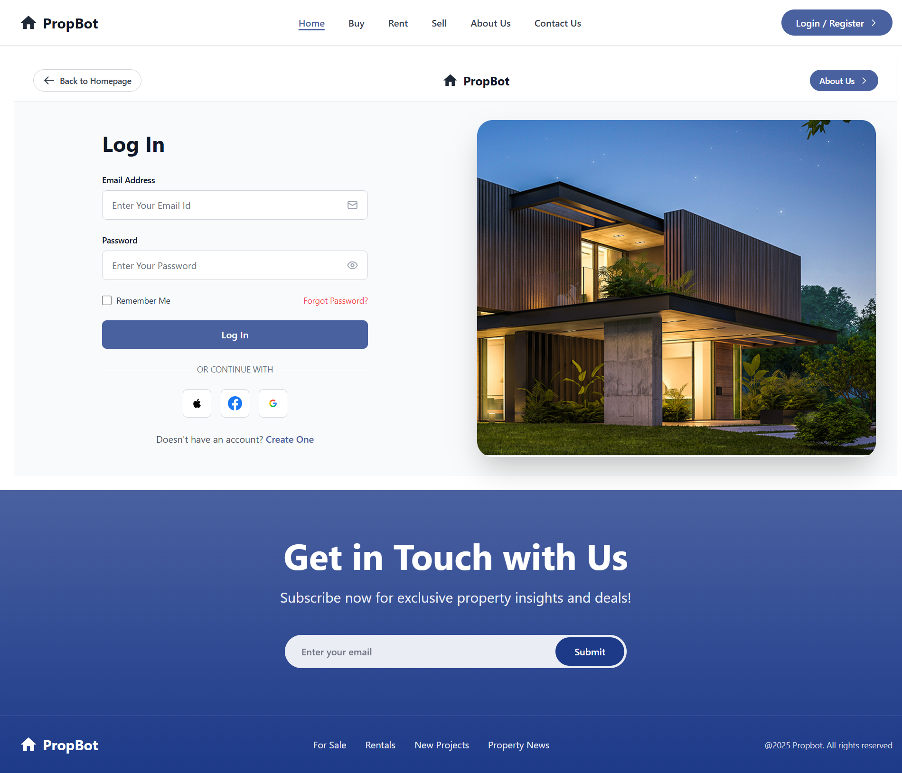

### 🏡 PropBot Real Estate

==> PropBot Real Estate is a **responsive 4-page web application** designed to help users explore properties available for **sale** and **rent** across various locations.  
The platform provides an intuitive interface, a clean UI, and **Firebase Authentication** for secure login/signup.  

---

### ✨ Features

✅ Responsive design – works seamlessly on desktop, tablet, and mobile  
✅ Property listings powered by **MockAPI**  
✅ User authentication with **Firebase (Email/Password)**  
✅ Reusable components like Navbar, Footer, Forms, and Cards  
✅ Optimized with **Vite** for fast development  
✅ Built with **React Router** for smooth navigation  

---

### 🚀 Tech Stack

- **React + Vite** – Core framework & build tool  
- **Tailwind CSS** – Styling & responsive design  
- **React Router DOM** – Client-side routing  
- **Firebase Authentication** – Secure login & signup  
- **MockAPI** – Fake backend for property listings  

---

## 📂 Project Structure

```bash

src/
|── assets/            # Pages Screenshot & Video Demonstratinn of the Assignment
│── components/        # Reusable UI components (Navbar & Footer)
│── pages/             # Page-level components (Home, Listings, Login, Signup)
│── services/          # Firebase configuration + API helpers
│── App.jsx            # Main app component
│── main.jsx           # Entry point
public/images/         # Project images & icons

```

---

### ⚙️ Setup Instructions

1. **Clone the repository**

```bash
   git clone https://github.com/your-username/propbot-real-estate.git
   cd propbot-real-estate
```

2. **Install dependencies**

```bash
   npm install
```

3. **Run the development server**

```bash
   npm run dev
```

👉 Then press **`o + Enter`** in the terminal to automatically open the project in your browser.

---

## 🔑 Firebase Setup

1. Go to [Firebase Console](https://console.firebase.google.com/)
2. Create a **new Firebase project**
3. Enable **Authentication → Sign-in method → Email/Password**
4. Copy the Firebase config object and paste it inside:

   ```
   src/services/firebase.js
   ```
5. On successful signup, user details appear in the **Authentication → Users** tab in Firebase.

---

### 🌐 API Details

This project uses [MockAPI](https://mockapi.io/) to fetch property data:

```
https://68b826bcb715405043274639.mockapi.io/api/properties/PropertyListing
```

* Provides **city**, **state**, **property name**, etc.
* Integrated into **Home.jsx** and **Listings.jsx** to display properties

⚠️ *Note*: Only text details are used from API. Property images are static to maintain design consistency.

---

### 📸 Screenshots

👉 Add screenshots of each page here:

* **Home Page**
  

* **Listings Page**
  

* **Login Page**
  

* **Signup Page**
  

---

## 🎥 Video Demonstration

👉 [Click here to watch the full demo](https://drive.google.com/file/d/1LGCQpOo0aTD2l31UKW_EPmKc6IvWQu2N/view?usp=sharing)

---

## 🌍 Deployment

This project will be deployed on **Netlify**.
👉 [Live Site Link](https://propbot-real-estate.netlify.app/)

---

## 📌 Deliverables Checklist

* [x] GitHub Repository with complete project code
* [x] Components (Navbar, Footer, etc.) created
* [x] Pages (Home, Listings, Login, Signup) built & responsive
* [x] Firebase Authentication integrated (Signup + Login)
* [x] MockAPI integration for property data
* [x] Screenshots added to README
* [x] Video demo link added to README
* [x] Netlify deployment link added to README

---

## 👨‍💻 Author

Developed by **Vivek** as part of the **ReactJS Frontend Development Assignment** – *PropBot Real Estate*.
